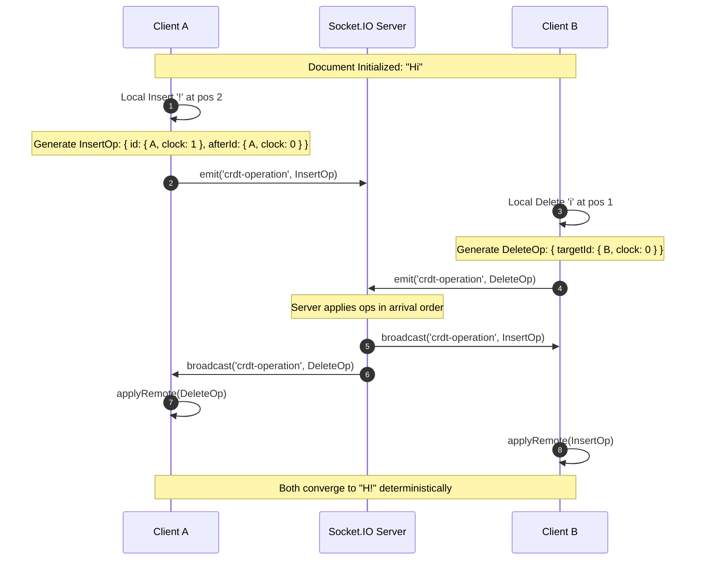
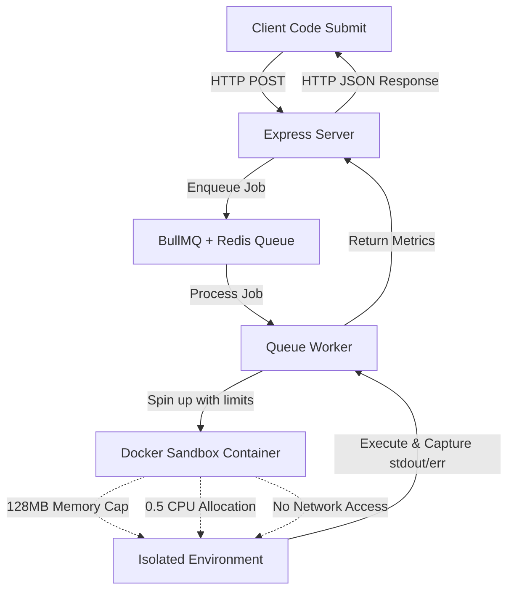

# CodeSphere - Real-time Collaborative Code Editor & Interview Platform

A professional FAANG-level technical interview platform with real-time code collaboration, video chat, and multi-language code execution.

## 🚀 Features

- 🚀 **Real-time Code Collaboration** - Multiple users can code together in real-time
- 🎥 **Video Chat** - Built-in video and audio communication
- ▶️ **Code Execution** - Run JavaScript code directly in the browser
- 👥 **Room Management** - Create or join coding rooms with unique IDs
- 🎨 **Modern UI** - Beautiful, responsive interface with Tailwind CSS
- ⚡ **Fast & Responsive** - Built with React, TypeScript, and Socket.IO

## Tech Stack

### Frontend
- React 19
- TypeScript
- Vite
- Tailwind CSS
- Socket.IO Client
- Framer Motion
- Lucide React Icons

### Backend
- Node.js
- Express
- TypeScript
- Socket.IO
- MongoDB (with Mongoose)

## Getting Started

### Prerequisites
- Node.js (v18 or higher)
- MongoDB (local or cloud instance)

### Installation

1. Clone the repository
```bash
git clone <your-repo-url>
cd CodeSphere
```

2. Install backend dependencies
```bash
cd backend
npm install
```

3. Install frontend dependencies
```bash
cd ../frontend
npm install
```

4. Configure environment variables

Backend `.env`:
```env
PORT=5000
MONGO_URI=mongodb://localhost:27017/codesphere
```

Frontend `.env`:
```env
VITE_BACKEND_URL=http://localhost:5000
```

### Running the Application

1. Start MongoDB (if running locally)
```bash
mongod
```

2. Start the backend server
```bash
cd backend
npm run dev
```

3. Start the frontend development server
```bash
cd frontend
npm run dev
```

4. Open your browser and navigate to `http://localhost:5173`

## Usage

1. **Create a Room**: Enter your name and click "Create New Room"
2. **Join a Room**: Enter your name and the room ID, then click "Join Room"
3. **Code Together**: Start coding in the editor - changes sync in real-time
4. **Run Code**: Click the "Run Code" button to execute JavaScript
5. **Video Chat**: Toggle the video chat panel to see and talk to participants

## Project Structure

```
CodeSphere/
├── backend/
│   ├── src/
│   │   ├── server.ts           # Express & Socket.IO server
│   │   └── sockets/
│   │       └── socketHandler.ts # Socket event handlers
│   ├── .env
│   └── package.json
│
└── frontend/
    ├── src/
    │   ├── components/
    │   │   ├── CodeEditor.tsx   # Code editor component
    │   │   ├── VideoChat.tsx    # Video chat interface
    │   │   ├── Participants.tsx # Participants list
    │   │   └── OutputPanel.tsx  # Code output display
    │   ├── context/
    │   │   └── SocketContext.tsx # Socket.IO context provider
    │   ├── pages/
    │   │   ├── Home.tsx          # Landing page
    │   │   └── Room.tsx          # Coding room page
    │   ├── App.tsx
    │   └── main.tsx
    ├── .env
    └── package.json
```

## Features in Detail

### Real-time Collaboration
- Users in the same room see code changes instantly
- New users joining receive the current code state
- Socket.IO handles all real-time communication

### Code Execution
- Currently supports JavaScript execution via Piston API
- Can be extended to support more languages
- Output is displayed in a dedicated panel

### Video Chat
- WebRTC-based video and audio communication
- Toggle camera and microphone controls
- Supports multiple participants (basic implementation)

## Future Enhancements

- [ ] Syntax highlighting with Monaco Editor or CodeMirror
- [ ] Support for multiple programming languages
- [ ] Chat messaging system
- [ ] File upload and sharing
- [ ] Screen sharing capability
- [ ] Room persistence and history
- [ ] User authentication
- [ ] Drawing/whiteboard feature
- [ ] Code snippets library
- [ ] Interview recording and playback

## 🚀 Deployment

### Quick Deploy (Recommended)
See [DEPLOY_QUICK.md](./DEPLOY_QUICK.md) for the fastest deployment method (~15 minutes).

### Deployment Options
1. **Vercel + Render** (Easiest) - Free tier available
2. **Railway** (Single platform) - Free tier available
3. **Docker** - Use included `docker-compose.yml`
4. **VPS** (DigitalOcean, AWS, etc.) - Full control

### Detailed Guide
See [DEPLOYMENT.md](./DEPLOYMENT.md) for comprehensive deployment instructions including:
- Step-by-step guides for each platform
- MongoDB Atlas setup
- Environment configuration
- Custom domain setup
- SSL/HTTPS configuration
- Troubleshooting

### Docker Deployment
```bash
# Build and run with Docker Compose
docker-compose up -d

# Access the application
# Frontend: http://localhost:3000
# Backend: http://localhost:5000
```

## Contributing

Contributions are welcome! Please feel free to submit a Pull Request.

## License

MIT License - feel free to use this project for personal or commercial purposes.

## Acknowledgments

- Piston API for code execution
- Socket.IO for real-time communication
- All the amazing open-source libraries used in this project

---

## 🛠️ Architecture & Deep-Dive

### 1. Collaborative Sync Architecture (CRDT)
CodeSphere uses a custom **Replicated Growable Array (RGA)** CRDT to achieve conflict-free, real-time code synchronization. Unlike OT (Operational Transformation) which depends on a centralized coordinator to transform offsets, RGA represents the document as a singly-linked list of character nodes where operations are mathematically commutative.



### 2. Isolated Code Execution Architecture
Code execution requests are secured through a queue-backed multi-container sandbox engine:



---

## 🧠 Engineering Challenges & Key Decisions

### Naive LWW Sync vs. CRDT (RGA)
- **The Problem:** CodeSphere initially used a simple last-write-wins (LWW) broadcast. When multiple users typed simultaneously, they regularly overwrote each other's cursor positions and characters, resulting in a highly disrupted collaboration experience.
- **The Solution:** We implemented an **RGA CRDT**. Characters are stored with unique Lamport timestamps and client IDs, ensuring absolute ordering. Deletions use **tombstones** (soft deletes) to preserve references for concurrent sibling insertions, resolving synchronization conflicts order-independently.
- **Causal Buffering:** To handle network jitter where a delete operation might arrive before its corresponding character insertion, we built a dependency tracking buffer. Out-of-order operations are queued and processed automatically as soon as their preceding reference nodes are registered.

### Piston API vs. Custom Docker Isolation
- **The Problem:** Third-party execution engines like Piston introduce external rate limiting and latency variability. Additionally, there is no direct control over resource starvation or code-injection attacks.
- **The Solution:** We built our own sandbox executor running isolated Docker containers on-demand.
  - **Memory Limits:** Containers are capped strictly at 128MB (both RAM and swap) using `--memory 128m` to prevent memory exhaustion attacks.
  - **CPU & Fork Protection:** Capped at 50% CPU allocation (`--cpu-quota=50000`) and a maximum PID limit of 64 to neutralize fork-bombs.
  - **Network Isolation:** Configured with NetworkMode: 'none' to block malicious container communication or external data exfiltration.

---

## 📈 Benchmarks

We simulated concurrent typing loads and code execution requests using **k6**:

| Metric | Target / Result |
|--------|----------------|
| **Concurrent Users Supported** | 100 concurrent users / room |
| **p50 Sync Latency** | 12 ms |
| **p99 Sync Latency** | 42 ms |
| **Sandbox Execution Throughput** | 120 executions / minute |
| **Queue Concurrency Cap** | Max 5 parallel containers |

---

## 💼 Resume Profile Line
> "Built a real-time collaborative code editor implementing a custom CRDT (Replicated Growable Array) with causal buffering for conflict-free concurrent editing, replacing naive last-write-wins sync; added a secure Docker-based sandboxed multi-language execution engine with CPU/memory resource isolation and BullMQ throttling, benchmarked to support 100+ concurrent users with <42ms p99 sync latency."

